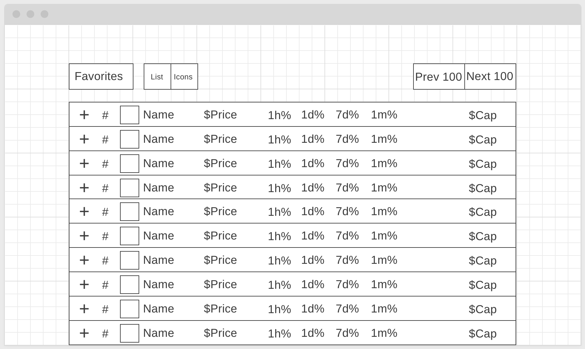
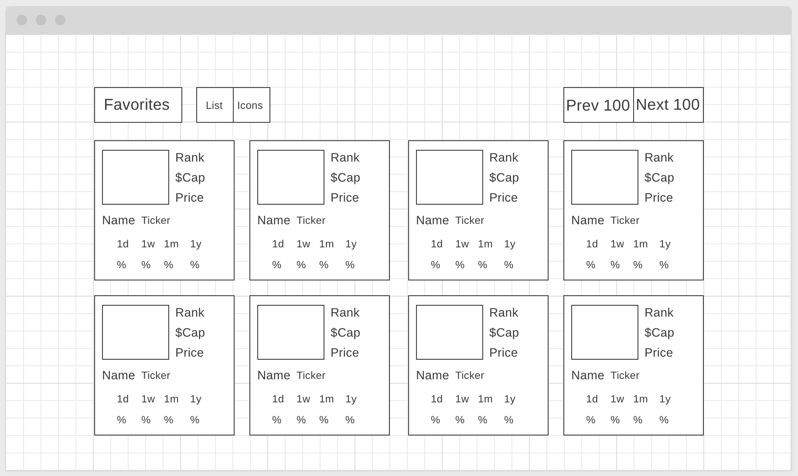
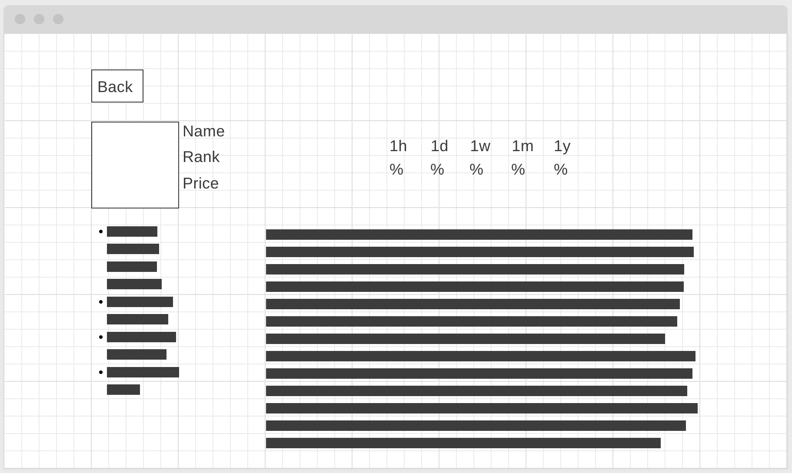

# App Idea

I'm building a cryptocurrency ranking site using the Nomics API for data. It's
for anyone who likes to check on the cryptocurrency market and view their
favorite cryptocurrencies.

# MVP

The MVP is to have a working site with 3 views/pages. There will be a Home page
with a list of cryptocurrencies ranked by market capitalization, A Coin page
with details about a specific coin, and a Favorites page that lists a select
group of coins.

# User Stories

- A user can view a list of cryptocurrencies
- A user can view an individual cryptocurrency details
- A user can favorite a cryptocurrency and view a list of their favorites

# Wireframe

[Rankings - Table View](https://wireframe.cc/dRnrqt)

[Rankings - Card View](https://wireframe.cc/cUVe1X)

[Coin Detail](https://wireframe.cc/m4fxWl)


# Mind Map

[Mind Map](https://app.mindmup.com/map/_free/2021/01/566a3dd0552b11eb9db317130ba8b086)

```
index.js
context/
--CoinContext.js
components/
--App.js
--Page.js
--Rankings.js
--NavBar.js
--List.js
--Row.js
--Card.js
--Header.js
--Footer.js
styles/
--App.css
--Rankings.css
--NavBar.css
--List.css
--Row.css
--Card.css
--Header.css
--Footer.css
services/
--nomics.js
hooks/
helpers/
pages/
--Home.js
--Coin.js
--Favorites.js
```
